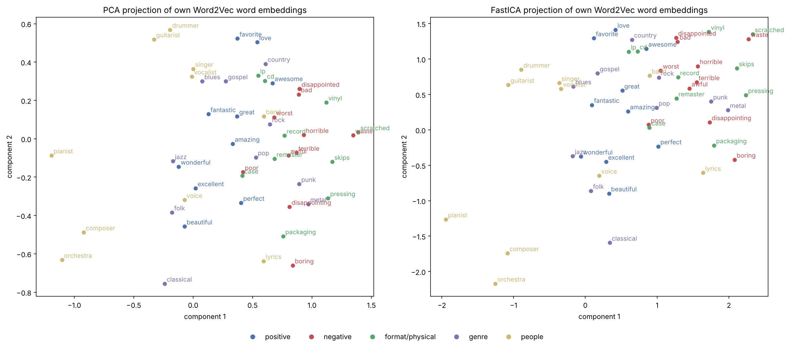

<!--
HOW THIS FILE MAPS TO THE ASSIGNMENT (do not delete this comment block until final submission):
- 9 required report sections below match the brief exactly, not the 8 task numbers.
- Section 2 (Preprocessing) and Section 3 (Analysis) both come from Task 2 in the notebook.
- Section 6 (Training procedure) and Section 7 (Evaluation) both come from Task 6.
- Max length: 6 A4 pages, EXCLUDING figures, tables, references and the Technology Statement.
- Every <!-- FIGURE:start --> ... <!-- FIGURE:end --> and <!-- TABLE:start --> ... <!-- TABLE:end -->
  block below is marked so you can mechanically strip them when producing Team-20-text.pdf.
  See Report/README.md for the two ways to render that second PDF.
-->

# Dataset Creation

<!-- TODO: 2-3 sentences. State the target label definition (rating >= 4 -> positive,
rating <= 3 -> negative) and report the class balance you found in the notebook (Task 1). -->

<!-- TABLE:start -->
<!-- TODO: insert class balance table/figure here, e.g. Report/images/class_balance.png -->
<!-- TABLE:end -->

# Preprocessing

<!-- TODO: Summarize your preprocessing pipeline (lowercasing, HTML-tag stripping,
punctuation/digit removal, tokenization) and justify each choice. Explicitly answer
"should all reviews be included?" here — this is a required question in the 2026 brief
that was not present in earlier years, don't skip it. -->

# Analysis

<!-- TODO: Descriptive statistics (number of reviews, average words per review, number
of unique words) and the 50 most common words before stopword removal. -->

<!-- FIGURE:start -->
<!-- TODO: insert Report/images/top50_words.png here -->
<!-- FIGURE:end -->

# Feature Representation

<!-- TODO: Bag-of-Words / stopword removal, the 100 most common words afterward, and
mutual information results (Task 3). Then TF-IDF + Logistic Regression results, and your
Word2Vec own-vs-pretrained comparison with the model you chose and why (Task 4). Explain
how you converted word embeddings into document embeddings. -->

<!-- TABLE:start -->
<!-- TODO: insert Report/tables/top100_mutual_information.csv (top rows) here -->
<!-- TABLE:end -->

<!-- Task 3 text (Kira) goes above this line. Task 4 below (Habir). -->

**TF-IDF baseline.** We represented each review by the TF-IDF weights of the 100 most frequent non-stopwords
and trained a Logistic Regression on a stratified 80/20 train/test split (37,730 / 9,433 reviews; IDF and all
models fitted on the training part only). With default settings the model reaches 86.6% accuracy, but this
equals the share of positive reviews: it detects only 4.9% of the negative reviews (macro F1 0.51, balanced
accuracy 0.52). Re-weighting the classes (`class_weight="balanced"`) raises negative recall to 74.9% and
balanced accuracy to 0.68, at the price of many false alarms (negative precision 0.23, accuracy 0.63)
(@tbl-tfidf). The coefficients are interpretable: generic praise words (*amazing, great, wonderful*) push
towards positive, *bad* towards negative. Notably, *did* and *does* are among the strongest negative
features: they are the remains of *didn't/doesn't* once "not" is removed as a stopword, so negation is
learned indirectly. Product words (*record, disc, sounds*) are also negative, because complaints often
concern the physical product rather than the music.

<!-- TABLE:start -->

| Model (test set) | Accuracy | Balanced acc. | Macro F1 | Neg. precision | Neg. recall |
|---|---|---|---|---|---|
| TF-IDF top-100 + LR | 0.866 | 0.521 | 0.508 | 0.484 | 0.049 |
| TF-IDF top-100 + LR, balanced | 0.634 | 0.682 | 0.549 | 0.231 | 0.749 |

: TF-IDF + Logistic Regression on the held-out test set. {#tbl-tfidf}

<!-- TABLE:end -->

**Word2Vec: own vs. pretrained.** We trained our own skip-gram Word2Vec (100 dimensions, window 5,
`min_count` 5, 10 epochs) on the training reviews *with* stopwords, so that negations and local context
are kept, and compared it with the pretrained `word2vec-google-news-300` model [@mikolov2013] (@tbl-w2v).
The pretrained model is trained on about 100B words and therefore gives stable vectors even for rare
words, and it covers more of our vocabulary (99.0% of running words, after a case-insensitive lookup,
since it is case-sensitive). However, it encodes the *general* meaning of words: its neighbours of
*pressing* are *pushing* and *urgent*, and of *skips* are *avoids* and *cancels*. Our own model learns
the domain meaning (*pressing* → vinyl, defect, reissue; *skips* → scratches, defect), is three times
smaller, and still covers 97.6% of running words; its weakness is that the small corpus leaves rare words
(mostly artist names) out or poorly estimated. In a 5-fold stratified cross-validation on the training set,
a balanced Logistic Regression scores a macro F1 of 0.696 on pretrained and 0.688 on own embeddings. We
prefer **our own model**: the gap is small (about 1.5 standard deviations), and the own model captures the
product-related meanings that drive complaints, is far lighter to deploy (the pretrained table would add
about 600 MB to the saved model), and is the model we analyse in the following sections.

<!-- TABLE:start -->

| | Own (CDs & Vinyl) | Pretrained (Google News) |
|---|---|---|
| Vocabulary, dimensions | 18,466 words, 100 | 3M words (500k loaded), 300 |
| Coverage of running words | 97.6% | 99.0% |
| Neighbours of *pressing* | vinyl, defect, equipment | pressed, pushing, vexing |
| Neighbours of *skips* | skipped, scratches, skipping | skipped, skipping, misses |
| CV macro F1, mean pooling | 0.688 ± 0.006 | 0.696 ± 0.003 |
| CV macro F1, IDF-weighted | 0.683 ± 0.004 | 0.682 ± 0.003 |

: Comparison of the two Word2Vec models (5-fold CV on the training set). {#tbl-w2v}

<!-- TABLE:end -->

**From word to document embeddings.** A review is represented by the average of the vectors of its words
that the model knows (a zero vector if none). We also tested an IDF-weighted average, which was slightly
worse for both models (@tbl-w2v): IDF up-weights rare words, whereas sentiment is mostly carried by frequent
words such as *great*, *love* and *bad*. Averaging discards word order, so constructions like "good songs,
terrible pressing" are only partly captured.

# Feature Selection and Dimensionality Reduction

We projected all 18,466 word vectors of our own model to two dimensions with PCA and FastICA
[@hyvarinen2000] and plotted 50 hand-picked words from five groups (@fig-pca-ica). Locally, some structure
survives: near-synonyms such as *terrible/awful* and *scratched/skips* stay close (only 15 and 7 of the
2,000 most frequent words lie closer), rock-band roles (*drummer, guitarist, vocalist*) and classical terms
(*orchestra, composer, pianist*) form two separate groups, and negative words lie on the same side as defect
words (*scratched, skips, waste*), suggesting the first component separates complaints about the product
from talk about the music. Globally, however, two dimensions are far too few. The two principal components
explain only 13.4% of the variance and only 3% of each word's ten nearest neighbours are preserved. The five
groups, clearly separated in the original space (cosine silhouette 0.27), overlap in 2D (silhouette -0.10).
Some synonyms are pulled apart: *great* and *excellent* have cosine similarity 0.72, yet 926 words lie closer
to *great* in the PCA plot. Positive and negative words are not cleanly separated either, which is expected
because Word2Vec groups words used in similar contexts, and *great* and *terrible* occur in very similar ones.

PCA and ICA give the same picture, only mirrored and stretched, with identical neighbour preservation (3.1% vs.
3.2%). This follows from how FastICA works: it first whitens the data with PCA to the requested two dimensions
and then only rotates these axes to make them independent, so it cannot recover information that PCA discarded.
PCA is the more interpretable of the two here, because its axes are ordered by explained variance.

<!-- FIGURE:start -->

{#fig-pca-ica width=100%}

<!-- FIGURE:end -->

# Training Procedure

<!-- TODO: KNN / GaussianNB / Logistic Regression setup on the Word2Vec document
embeddings, your K-Fold cross-validation setup, and your hyperparameter search
(GridSearchCV/RandomizedSearchCV) on Logistic Regression, including the parameter grid
you used (Task 6, first half). -->

# Evaluation

<!-- TODO: Report final performance on a held-out test set — NOT the cross-validation
search score. Be explicit that these are two different numbers and that the test-set
score is what you're claiming as your model's performance. Compare KNN vs GaussianNB vs
Logistic Regression, and compare against the TF-IDF baseline from the Feature
Representation section (Task 6, second half). -->

<!-- TABLE:start -->
<!-- TODO: insert model comparison table (accuracy, F1, precision, recall per model) here -->
<!-- TABLE:end -->

# Clustering and Topic Modeling

<!-- TODO: Agglomerative Clustering and DBSCAN on the Word2Vec word embeddings — what do
the clusters correspond to? Then BERTopic and FuzzyTM topics extracted from the reviews,
with the quality metric(s) you used to evaluate them. Report the vocabulary pruning
threshold you used for FuzzyTM — this is explicitly required (Task 7). -->

<!-- FIGURE:start -->
<!-- TODO: insert clustering / topic visualization here -->
<!-- FIGURE:end -->

# Discussion and Limitations

<!-- TODO: Which representation + model performed best overall, and why. Limitations of
your approach (e.g. mean-pooled embeddings lose word order, corpus size limits for your
own Word2Vec, DBSCAN's sensitivity to eps, FuzzyTM memory constraints). Concrete
suggestions for improvement (Task 8). -->

# References

<!-- TODO: cite scikit-learn, gensim, BERTopic, FuzzyTM, and any papers you reference for
methodology choices (e.g. the original Word2Vec paper if you discuss it, Amazon Reviews
2023 dataset paper). Use a consistent citation style. -->

::: {#refs}
:::

# Technology Statement

<!-- TODO: Required statement on which tools/AI assistance you used while producing this
report and code, per your course's academic integrity policy. Excluded from the 6-page
count but must be present. Check the exact wording your course expects for this
statement — it was not reproduced in full in the assignment PDF text extracted here. -->
